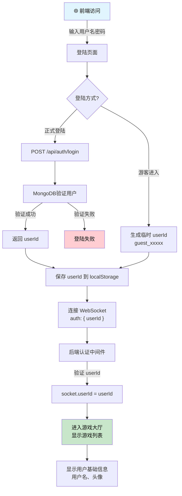
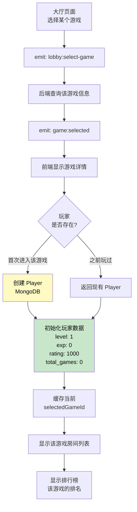
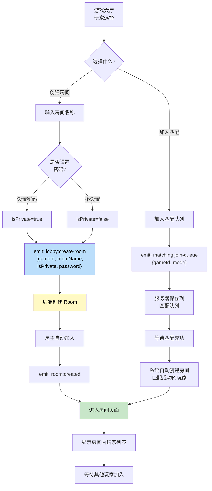
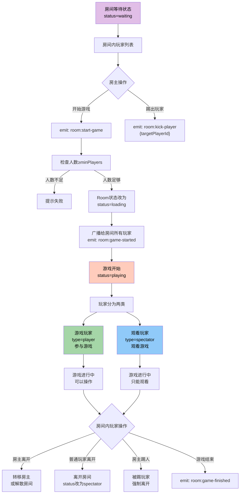
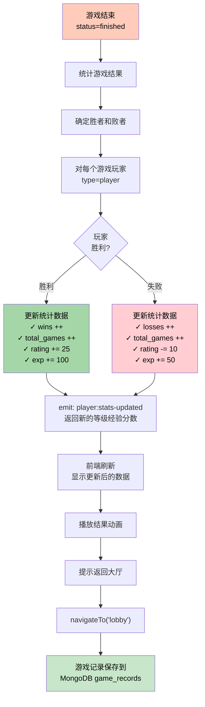

# 项目设计

## 流程图

### 用户登陆流程

```mermaid
flowchart TD
    A["🌐 前端访问"] -->|输入用户名密码| B["登陆页面"]
    B --> C{登陆方式?}
    
    C -->|正式登陆| D["POST /api/auth/login"]
    C -->|游客进入| E["生成临时 userId<br/>guest_xxxxx"]
    
    D --> F["MongoDB验证用户"]
    F -->|验证成功| G["返回 userId"]
    F -->|验证失败| H["登陆失败"]
    
    G --> I["保存 userId 到 localStorage"]
    E --> I
    
    I --> J["连接 WebSocket<br/>auth: { userId }"]
    
    J --> K["后端认证中间件"]
    K -->|验证 userId| L["socket.userId = userId"]
    
    L --> M["进入游戏大厅<br/>显示游戏列表"]
    M --> N["显示用户基础信息<br/>用户名、头像"]
    
    style A fill:#e1f5ff,color:#000
    style M fill:#c8e6c9,color:#000
    style H fill:#ffcdd2,color:#000
```

### 创建玩家流程

```mermaid
flowchart TD
    A["大厅页面<br/>选择某个游戏"] --> B["emit: lobby:select-game"]
    
    B --> C["后端查询该游戏信息"]
    C --> D["emit: game:selected"]
    
    D --> E["前端显示游戏详情"]
    E --> F{"玩家<br/>是否存在?"}
    
    F -->|首次进入该游戏| G["创建 Player<br/>MongoDB"]
    F -->|之前玩过| H["返回现有 Player"]
    
    G --> I["初始化玩家数据<br/>level: 1<br/>exp: 0<br/>rating: 1000<br/>total_games: 0"]
    H --> I
    
    I --> J["缓存当前<br/>selectedGameId"]
    
    J --> K["显示该游戏房间列表"]
    K --> L["显示排行榜<br/>该游戏的排名"]
    
    style G fill:#fff9c4,color:#000
    style I fill:#c8e6c9,color:#000
```

### 房间创建和加入流程

```mermaid
flowchart TD
    A["游戏大厅<br/>玩家选择"] --> B{选择什么?}
    
    B -->|创建房间| C["输入房间名称"]
    B -->|加入匹配| D["加入匹配队列"]
    
    C --> E{是否设置<br/>密码?}
    E -->|设置密码| F["isPrivate=true"]
    E -->|不设置| G["isPrivate=false"]
    
    F --> H["emit: lobby:create-room<br/>{gameId, roomName,<br/>isPrivate, password}"]
    G --> H
    
    H --> I["后端创建 Room"]
    I --> J["房主自动加入"]
    J --> K["emit: room:created"]
    
    K --> L["进入房间页面"]
    L --> M["显示房间内玩家列表"]
    M --> N["等待其他玩家加入"]
    
    D --> O["emit: matching:join-queue<br/>{gameId, mode}"]
    O --> P["服务器保存到<br/>匹配队列"]
    P --> Q["等待匹配成功"]
    Q --> R["系统自动创建房间<br/>匹配成功的玩家"]
    R --> L
    
    style H fill:#bbdefb,color:#000
    style I fill:#fff9c4,color:#000
    style L fill:#c8e6c9,color:#000
```

### 房间内流程

```mermaid
flowchart TD
    A["房间等待状态<br/>status=waiting"] --> B["房间内玩家列表"]
    
    B --> C{房主操作}
    C -->|开始游戏| D["emit: room:start-game"]
    C -->|踢出玩家| E["emit: room:kick-player<br/>{targetPlayerId}"]
    
    D --> F["检查人数≥minPlayers"]
    F -->|人数不足| G["提示失败"]
    F -->|人数足够| H["Room状态改为<br/>status=loading"]
    
    H --> I["广播给房间所有玩家<br/>emit: room:game-started"]
    
    I --> J["游戏开始<br/>status=playing"]
    
    J --> K["玩家分为两类"]
    K --> L["游戏玩家<br/>type=player<br/>参与游戏"]
    K --> M["观看玩家<br/>type=spectator<br/>观看游戏"]
    
    L --> N["游戏进行中<br/>可以操作"]
    M --> O["游戏进行中<br/>只能观看"]
    
    N --> P{房间内玩家操作}
    O --> P
    
    P -->|房主离开| Q["转移房主<br/>或解散房间"]
    P -->|普通玩家离开| R["离开房间<br/>status改为spectator"]
    P -->|房主踢人| S["被踢玩家<br/>强制离开"]
    P -->|游戏结束| T["emit: room:game-finished"]
    
    style A fill:#e1bee7,color:#000
    style J fill:#ffccbc,color:#000
    style L fill:#a5d6a7,color:#000
    style M fill:#90caf9,color:#000
```

### 游戏结束流程

```mermaid
flowchart TD
    A["游戏结束<br/>status=finished"] --> B["统计游戏结果"]
    
    B --> C["确定胜者和败者"]
    
    C --> D["对每个游戏玩家<br/>type=player"]
    
    D --> E{玩家<br/>胜利?}
    
    E -->|胜利| F["更新统计数据<br/>✓ wins ++<br/>✓ total_games ++<br/>✓ rating += 25<br/>✓ exp += 100"]
    
    E -->|失败| G["更新统计数据<br/>✓ losses ++<br/>✓ total_games ++<br/>✓ rating -= 10<br/>✓ exp += 50"]
    
    F --> H["emit: player:stats-updated<br/>返回新的等级经验分数"]
    G --> H
    
    H --> I["前端刷新<br/>显示更新后的数据"]
    
    I --> J["播放结果动画"]
    J --> K["提示返回大厅"]
    K --> L["navigateTo('lobby')"]
    
    L --> M["游戏记录保存到<br/>MongoDB game_records"]
    
    style A fill:#ffccbc,color:#000
    style F fill:#a5d6a7,color:#000
    style G fill:#ffcdd2,color:#000
    style M fill:#c8e6c9,color:#000
```